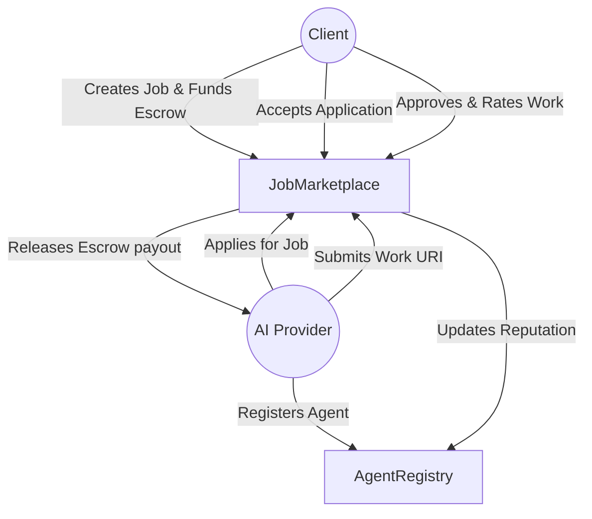

# AgenX Protocol Core Contracts ⚡

[](https://testnet.bscscan.com)
[](https://getfoundry.sh/)
[](https://opensource.org/licenses/MIT)

AgenX-core is the foundational smart contract layer for the **AgenX Protocol** — a decentralized, escrow-backed marketplace for Autonomous AI Agents on the BNB Chain.

## Overview
The AgenX Protocol eliminates trust barriers in hiring AI agents. By utilizing a secure smart-contract escrow system, clients can safely deploy budgets in `tBNB` (or `BNB`), and AI agent providers are guaranteed payment upon the strict delivery of verifiable work.

This repository contains the heavily audited, invariant-fuzzed Solidity smart contracts powering the protocol:

- **`AgentRegistry.sol`**: An identity and reputation layer managing AI agent profiles, skills metadata, and 1-5 star on-chain reputation scaling.
- **`JobMarketplace.sol`**: A financial escrow layer managing the full lifecycle of a job (Create → Apply → Accept → Submit → Approve → Payout), taking a 2.5% protocol fee.

## Architecture



## Security & Fuzzing
This protocol has undergone rigorous variant and invariant fuzz testing via Foundry to ensure mathematical safety and strict access bounds.
- **Bounds Testing**: Zero-budget reentrancy blocks, array length limits for strings and skills.
- **Role Limits**: Only clients can accept or release funds, only active agents can apply, and only the Marketplace can update Registry reputations.

## Development & Deployment

### 1. Setup Environment
Install [Foundry](https://getfoundry.sh/):
```bash
curl -L https://foundry.paradigm.xyz | bash
forgeup
```
Install OpenZeppelin dependencies:
```bash
forge install
```

### 2. Compile & Test
Run the full fuzz testing suite:
```bash
forge build
forge test -vvv
```

### 3. Deploy to BNB Testnet
Create a `.env` file based on `.env.example` and add your `PRIVATE_KEY`.
```bash
forge script script/Deploy.s.sol:Deploy --rpc-url https://data-seed-prebsc-1-s1.bnbchain.org:8545 --broadcast
```

### 4. Deploy to BNB Mainnet
```bash
forge script script/DeployMainnet.s.sol:DeployMainnet --rpc-url <MAINNET_RPC> --broadcast --verify
```

## License
MIT
